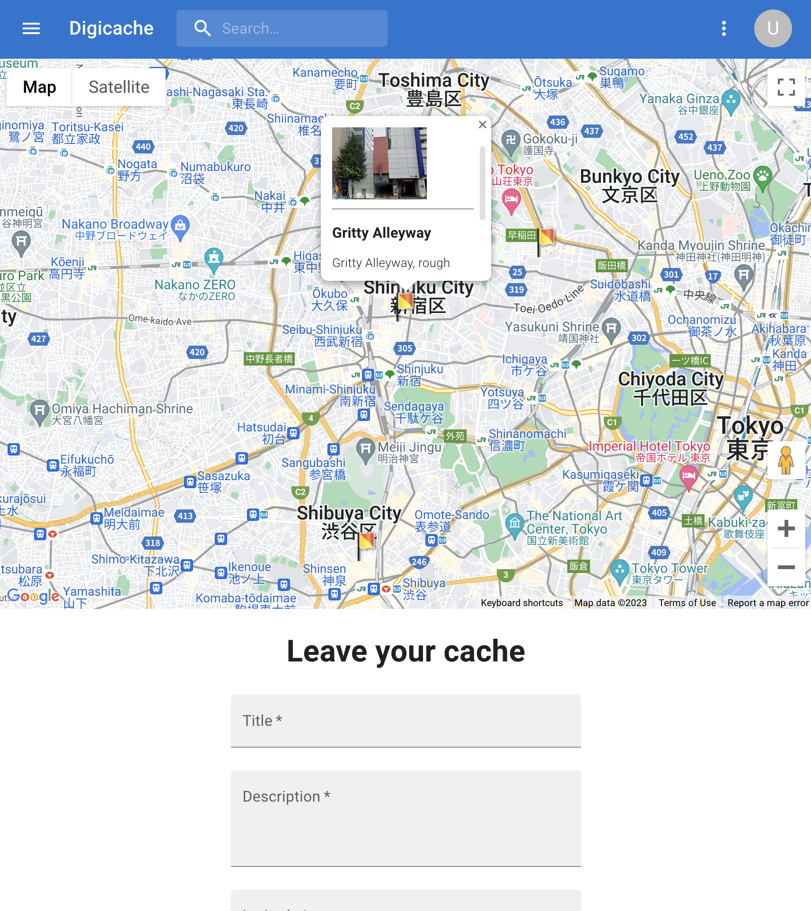
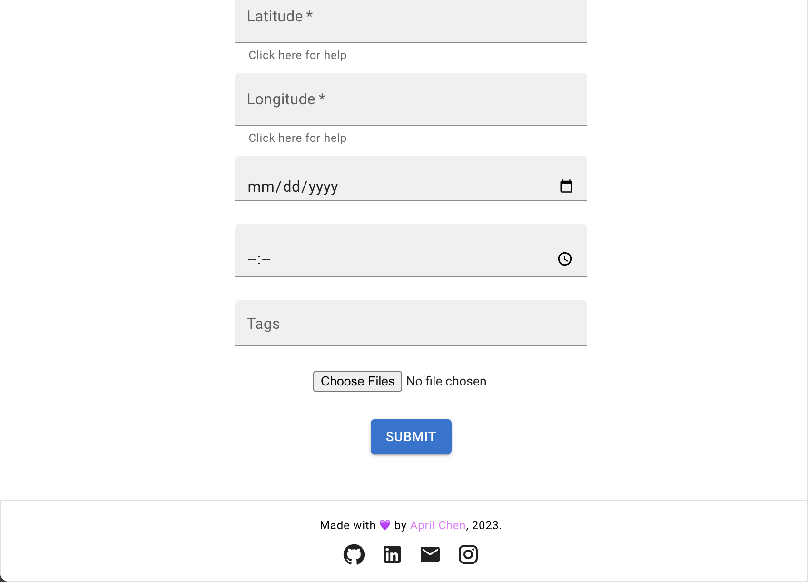

# Digicache-2.0
Share and see the geotagged photos and videos of the hidden parts of the world.

### Tech Stack:
###### Client-side:
 - HTML/CSS
 - Typescript
 - React w/ Vite
 - Material UI
 - Google Maps API
 - Axios

 ###### Server-side:
  - Django Rest Framework
  - Djoser, Axios
  - PostgreSQL

### Install and Run:
Run the following commands in the client folder: 
 - npm install
 - npm start

Run the following commands in the server folder:
 - python3 manage.py makemigrations
 - python3 manage.py migrate
 - python3 manage.py runserver

Happy exploring!
