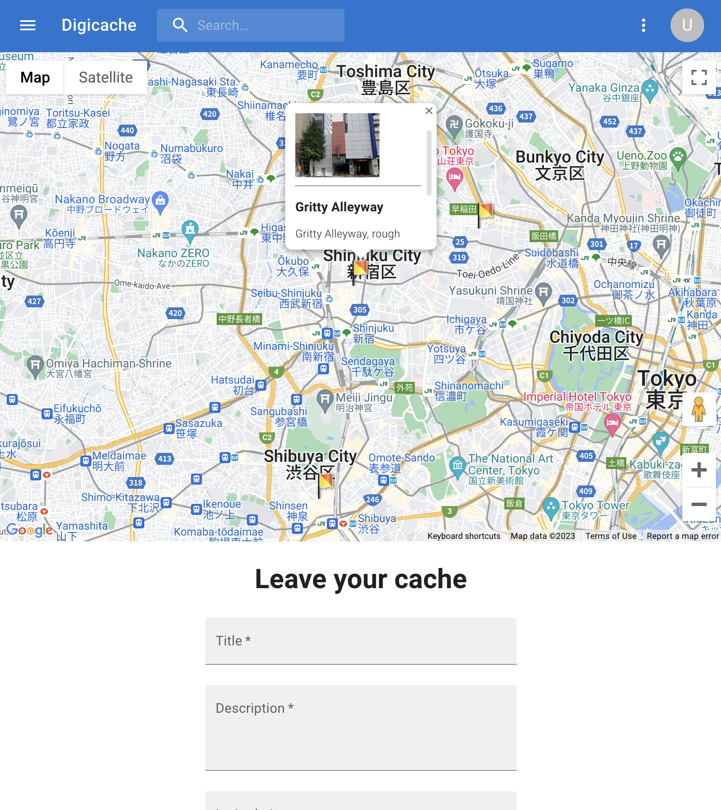
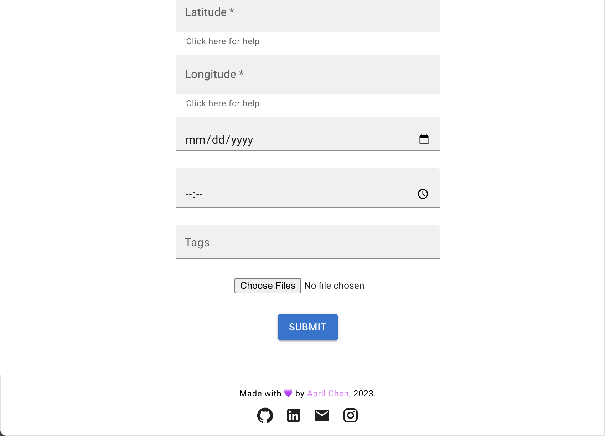

# Digicache 2.0
Share and see the geotagged photos and videos of the hidden parts of the world.

### Tech Stack:
###### Client-side:
 - HTML/CSS
 - Typescript
 - React w/ Vite
 - Material UI
 - Google Maps API
 - Axios

 ###### Server-side:
  - Node.js, Express.js, GraphQL
  - Apollo-Server
  - MongoDB

 ###### Dev-ops:
  - Docker, Docker Hub (Container Registry)
  - Kubernetes, AWS Elastic Beanstalk
  - Jenkins (CI/CD)

You can find Digicache 1.0 (The previous version) at [this link:](https://github.com/aprilschen/Digicache-1) 

Happy exploring!
